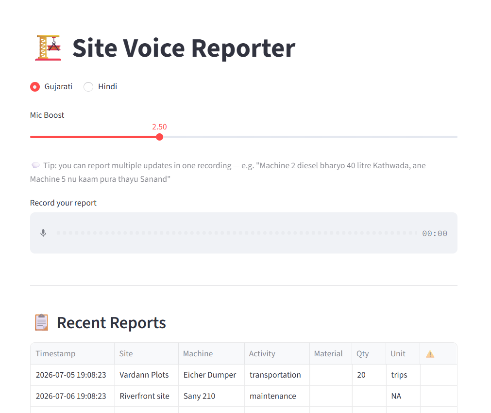
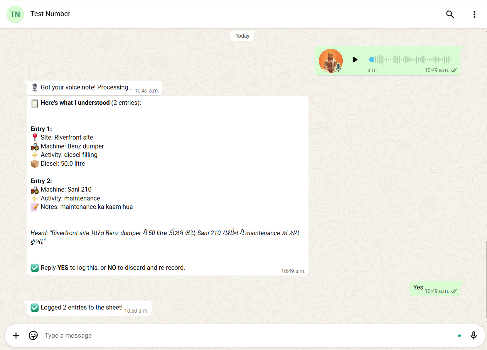
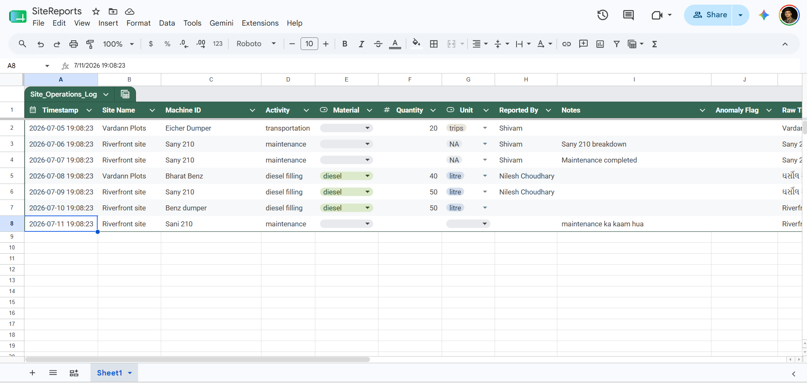

# Voice-Based Site Reporting System 🏗️
**Bol ke report karo — Gujarati ya Hindi mein**

A Bharat-first, voice-driven site reporting tool built for Surendra Construction.
Workers speak in Gujarati or Hindi → AI transcribes + extracts structured data → logs to Google Sheets.
No typing, no forms — just talk.

---

## How it works

```
Worker speaks (Gujarati/Hindi)
        ↓
Groq Whisper (whisper-large-v3, full accuracy model)
        ↓
Gemini — splits into MULTIPLE entries if the worker described several
updates in one recording ("Machine 2 diesel bharyo Kathwada, ane
Machine 5 nu kaam pura thayu Sanand" → 2 separate structured entries)
        ↓
Review step — worker/supervisor confirms before anything is saved
        ↓
Google Sheets — logged with full audit trail (raw transcript kept)
```

---

## Two ways to submit a report

### 1. Streamlit app (browser, desktop or mobile)
Record with the mic, review the extracted fields inline, edit anything
that's wrong, then confirm & log.

### 2. WhatsApp (Meta Cloud API — free tier)
Send a voice note to the business WhatsApp number. The bot replies with
a summary of what it understood and asks:

> ✅ Reply **YES** to log this, or **NO** to discard and re-record.

Nothing touches Google Sheets until the worker confirms — so a bad
transcription never silently ends up in the sheet.

---

## Screenshots

Add your own screenshots to a `screenshots/` folder next to this README, then
they'll render automatically wherever this file is viewed (GitHub, etc.).

**Streamlit app — multi-entry extraction**
_Shows one voice note describing several updates, split into separate editable entries._



<br>

**WhatsApp — confirm-before-log flow**
_Voice note → bot's summary reply → worker replies YES → confirmation._



<br>

**Google Sheets — logged output**
_A few rows showing the structured columns plus the raw transcript audit trail._




To use these, save your actual screenshot files into a `screenshots/` folder
with those exact filenames, then delete the ` ```markdown ` code fences above
so the images render directly instead of showing as text.

---

## Project structure

```
voice_site_reporter/
├── app.py                  # Streamlit UI — record, review, edit, log
├── pipeline.py             # ASR (Groq Whisper) + extraction (Gemini)
├── sheets_logger.py        # Google Sheets read/write
├── whatsapp_webhook.py     # WhatsApp bot with confirm-before-log flow
├── daily_summary.py        # Optional: end-of-day email digest
├── test_pipeline.py        # Run this first — checks every component
├── .env                    # Your API keys (never commit this)
├── credentials.json        # Google service account (never commit this)
├── requirements.txt
└── SETUP_GUIDE.md          # Full step-by-step setup, incl. WhatsApp
```

---

## Quick start

```bash
pip install -r requirements.txt
cp .env.example .env        # fill in your keys — see SETUP_GUIDE.md
python test_pipeline.py     # confirms every piece is wired up correctly
python -m streamlit run app.py
```

For WhatsApp, run in a separate terminal:
```bash
python whatsapp_webhook.py
ngrok http 5000             # exposes it for Meta's webhook
```
Full walkthrough — Meta app setup, webhook config, the WABA subscription
step that's easy to miss — is in `SETUP_GUIDE.md`.

---

## Features

- 🎙️ Voice recording in-browser (Gujarati + Hindi), full-accuracy Whisper model
- 🧠 Handles multiple updates in a single recording — one voice note, several logged rows
- ✏️ Editable review step before anything is saved, on both Streamlit and WhatsApp
- 📊 Auto-logs to Google Sheets with the raw transcript kept as an audit trail
- 📱 WhatsApp bot with a confirm-before-log flow (reply YES/NO)
- 🚨 Anomaly flag — diesel entries over 100L are flagged for the manager
- 📧 Optional daily summary email to the site manager (`daily_summary.py`)
- 🔊 Adjustable mic boost for quiet laptop microphones

---

## Notes on accuracy

- Uses the full `whisper-large-v3` model rather than the turbo variant —
  slower per request but noticeably better on Gujarati/Hindi speech
- `pipeline.py` includes a `LANGUAGE_PROMPTS` vocabulary hint — add your
  own real site names, machine IDs, and recurring terms there to further
  improve transcription accuracy for your specific sites
- Gemini extraction model is auto-detected against your API key
  (prefers `gemini-2.5-flash-lite`) and self-heals if Google deprecates
  a model mid-session

---

## Known limits (for a small pilot, not production scale)

- WhatsApp confirmation state is stored in memory — resets if the
  webhook server restarts mid-conversation
- Meta's temporary access token expires every 24 hours during testing;
  switch to a System User token if you want to stop refreshing it daily
- Free tiers in use: Gemini free tier, Groq free tier, Meta Cloud API
  (1,000 conversations/month) — fine for a pilot, worth reviewing usage
  if this scales up across more workers/sites
